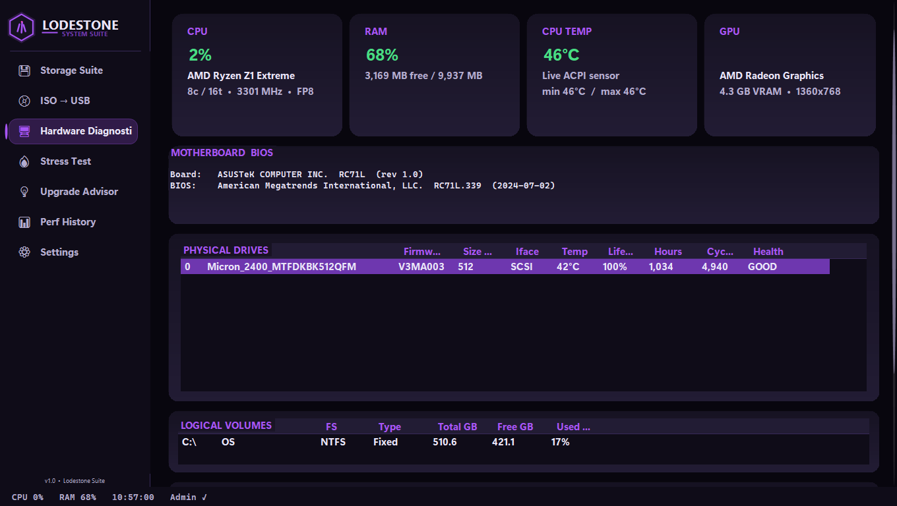

# LodeForge — A Free Windows System Suite

A premium-feeling, dark-themed Windows utility that does what you'd normally need a half-dozen separate tools for.

Live hardware monitoring, NVMe + SATA SMART, stress testing, ISO → USB writing, drive cloning, upgrade advice, and a Pi-hole-style **phone dashboard** you open from any browser on your Wi-Fi.

Single 76 MB self-contained exe. No installer, no telemetry, no ads.



---

## ✨ Features

### 🖥 Hardware Diagnostics
- Live CPU / RAM / GPU% / CPU temperature with min-max tracking
- Motherboard + BIOS info, with an age warning if your BIOS is more than 3 years old
- Physical drives table — model, firmware, interface, temp, life %, hours, cycles, health
- Logical volumes — used/free per partition with color-graded warnings
- Per-drive **Drive Health** card (CrystalDiskInfo-style):
  - GOOD / CAUTION / FAIL badge with derived health %
  - Live temperature with thresholds (≤55 °C green, 55-70 amber, >70 red)
  - Power-on hours (auto-formats to years past one year of runtime)
  - Power cycles
  - Reallocated sectors / pending sectors / life left
- **Reads SMART from NVMe drives directly via `IOCTL_STORAGE_QUERY_PROPERTY`** when WMI's reliability counter falls short — same path Task Manager uses, no vendor driver required.

### 💾 Storage Suite
- **Clone**: byte-for-byte drive cloning with PS4 mode (extra retries for encrypted/quirky drives) and dead-drive recovery (skip bad sectors instead of stopping).
- **Format**: NTFS / exFAT / FAT32, GPT or MBR, custom label.
- **Resize**: extend a partition into adjacent free space.
- **USB Speed**: write/read benchmark with USB 3.2 Gen 2 / USB 3.0 / USB 2.0 / USB 1.1 grading.

### 📀 ISO → USB
- Bootable USB writer.
- GPT (modern UEFI) or MBR (legacy BIOS) schemes, UEFI / BIOS / both targets.
- Optional verify-after-write that reads back and compares.

### 🔥 Stress Test
- Five intensity presets: ⚡ Quick (30 s), 🔥 Standard (2 min), 💪 Extended (5 min), 🛠 Endurance (10 min), 🏆 Max Burn (30 min).
- Outputs a benchmark score, a 1–10 Silicon Rating, and a thermal verdict (✓ Stable / ⚠ Throttled, with peak temp).

### 💡 Upgrade Advisor
- Detects whether you're on a **desktop, laptop, or handheld** and tailors the advice.
- **297 GPUs + 626 CPUs** in the bench database — desktop, mobile, and iGPU coverage from ~2005 (Pentium D, GeForce 7800 GTX) through 2025 (RTX 5090, RX 9070 XT, Ryzen AI HX 370).
- Calibrated against real-world fps numbers on Radeon 780M (ROG Ally), Steam Deck Aerith APU, and RTX 4060 / 4090 desktop reference benches.
- Budget filter ($150 / $300 / $500 / $800 / $1.2k caps).
- Target-resolution filter (720p → 4K).
- **"Can my PC run it?"** check with:
  - Fuzzy keyword + spell-tolerant game matching ("cyberpnk", "stalkr 2", "cyber punk" all match).
  - RAM in the verdict — severe shortage overrides GPU verdict ("game won't launch").
  - FSR/DLSS-aware tiers — handhelds correctly verdict as "playable on low + upscaling" instead of a flat NO.

### 📊 Performance History
- Background CPU / RAM / temp logging every 2 seconds.
- LodeChart visualization with live updates.
- One-click CSV export.

### ⚙ Settings (everything auto-saves)
- **Stealth Mode** — minimize to system tray, double-click to restore.
- **Laptop Power Guard** — auto-switches to power-saver via `powercfg` at <20% battery.
- **Performance Overlay** — always-on-top dark HUD with CPU / GPU / RAM / Temp.
- **Dead Drive Recovery default** — preset for the Clone tab.
- **RGB Status Sync** — sends temp-graded color to OpenRGB on `localhost:6742`.
- **📱 Phone Dashboard** — Pi-hole-style. Toggle on, get a URL, open it from any device on your Wi-Fi. Mobile-first dark UI, polls every 1.5 s, shows CPU / RAM / GPU / temp / system info.

### 🎨 Polish
- **Borderless fullscreen** on startup so the title bar and taskbar don't interrupt your dashboard view. F11 toggles back to a normal window.
- **DPI-aware** — handles 100 → 200% Windows display scaling cleanly. Auto-detects compact mode (e.g., ROG Ally) and scales every dimension, font, and padding to match.
- Custom-painted dark controls throughout — no XAML, no third-party UI libraries, no telemetry phone-home.

---

## 📥 Install

1. Download **`LodeForge.exe`** from the [latest release](../../releases/latest).
2. Right-click → **Run as Administrator** (required for SMART ioctls, firewall rule, powercfg).
3. (Optional) Pin to Start or create a shortcut.

That's it. Single 76 MB exe, self-contained .NET 8, no installer.

---

## 🛠 Build from source

Requires the **.NET 8 SDK** on Windows.

```bat
dotnet publish Forge/Forge.csproj ^
  -c Release -r win-x64 --self-contained ^
  -p:PublishSingleFile=true ^
  -p:IncludeNativeLibrariesForSelfExtract=true ^
  -p:EnableCompressionInSingleFile=true ^
  -o ./dist
```

A self-test mode is included for the Upgrade Advisor's bench engine:
```bat
LodeForge.exe --self-test report.txt
```
Should output `TOTAL: 1026 passed, 0 failed, 0 warnings`.

---

## 🧰 Tech

- **C# / .NET 8 / WinForms** — single-file self-contained publish, ReadyToRun.
- **Custom dark theme** — every control hand-painted (rounded buttons, owner-drawn combos / list views, transparent flow panels, hidden native scrollbars).
- **DPI scaling** — internal `DpiScale` factor adapts to detected screen DIP height, scales fonts + dimensions consistently.
- **WMI + native ioctls** — Win32_DiskDrive, MSStorageDriver_ATAPISmartData, MSFT_PhysicalDisk, and direct `IOCTL_STORAGE_QUERY_PROPERTY` for NVMe SMART when WMI is incomplete.
- **HttpListener** for the phone dashboard, with auto-firewall-rule via `netsh`.
- **OpenRGB SDK client** — raw TCP to `localhost:6742`, sends temp-graded color to controller LED 0.

---

## 💚 Support

If LodeForge saves you a SMART tool, a stress-test license, or a USB-bootable utility, donations keep projects like this coming.

**Cash App: `$SammyAlqouqa4`**

Every dollar funds the next feature. Thanks for using LodeForge.

---

## 📝 License

Released under the MIT License. Use it, share it, fork it. Just don't pretend you wrote it.
